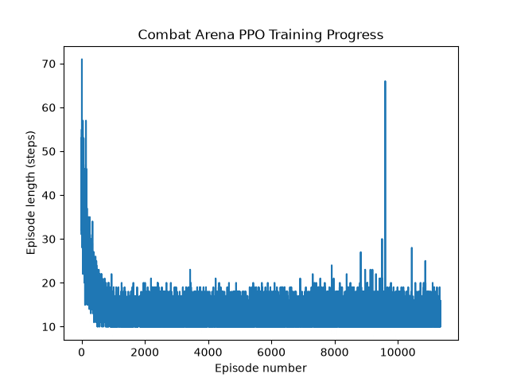

# Combat Arena PPO Agent

A reinforcement learning agent that learns to fight: approaching, attacking, and dodging a scripted opponent: trained with Proximal Policy Optimization (PPO) using Stable-Baselines3 and a custom Gymnasium environment.

## What this project does

Unlike a pre-built Gymnasium environment (like CartPole), this project required designing and implementing the entire combat simulation from scratch: positions, health, attack ranges, and reward rules. The agent (the "enemy") learns purely through trial and error to defeat a scripted opponent (the "player") that automatically approaches and attacks.

## Results

The final trained agent wins **20 out of 20** evaluation episodes, typically finishing fights in 10–18 steps while retaining 70–80% of its own health.



Note: unlike CartPole (where a longer episode is better), a **shorter** episode length here is the good outcome, it means the agent is winning fights decisively rather than stalling. The graph shows episode length dropping sharply in the first ~1,000 episodes as the agent converges on an efficient winning strategy, then staying consistently low for the remainder of training.

## The real challenge: reward design, not training

Getting this environment to actually produce winning behavior took several rounds of debugging, not the training code itself, but the **reward function**, which is a genuinely common real-world RL problem. Three distinct issues came up:

1. **Free reward exploit.** An early version rewarded every successful dodge directly. The agent learned to dodge on every single step forever, collecting free reward while never engaging in combat at all.
2. **A mutual-KO loophole.** A "win bonus" checked only whether the opponent died, not whether the agent itself also died in the same exchange, so trading fatal blows was rewarded as if it were a clean win.
3. **A structurally unwinnable fight.** The scripted opponent attacked on every single step it was in range, with no cooldown, meaning any exchange of blows always ended in mutual destruction, regardless of reward tuning. The real fix was adding an attack cooldown to the opponent, creating actual safe windows for the agent to land hits without retaliation.

Each of these was diagnosed by tracing *exactly* when a reward condition fired, not just what it was intended to do a good reminder that in RL, the agent will always find the literal incentive you wrote, not the behavior you meant.

## How it works

The agent is trained with **PPO**, which plays batches of episodes, measures which actions correlated with better-than-expected reward, and nudges its behavior slightly toward those actions in small, controlled steps to avoid destabilizing prior learning.

**Observations** (6 numbers, normalized to roughly -1 to 1):
- Enemy position, player position
- Distance between them
- Enemy HP, player HP
- Whether the player is currently in attack range

**Actions** (4 discrete choices):
- Move toward player
- Move away from player
- Attack
- Dodge

**Reward structure:**
- `+10` for landing a hit
- `-15` for getting hit
- `+50` for a clean win (opponent dead, agent alive)
- `-30` for dying (solo loss or mutual KO)
- `-20` for stalling to a timeout draw
- Small distance-closing reward to encourage engagement

## Project structure

- `combat_env.py` — the custom Gymnasium environment (combat rules, reward logic, pygame rendering)
- `train_combat.py` — trains the PPO agent
- `evaluate_combat.py` — runs the trained agent with a visual pygame window and reports win/loss/draw stats
- `plot_combat_results.py` — generates the training curve graph
- `test_combat.py` — sanity-checks the environment with random actions before training

## Tech stack

- Python 3.12
- Gymnasium (custom environment)
- Stable-Baselines3 (PPO)
- pygame — visualization
- Matplotlib / Pandas — training graph

## Running it yourself

```bash
pip install gymnasium stable-baselines3 pygame matplotlib pandas
python train_combat.py      # trains and saves the agent
python evaluate_combat.py   # watches the trained agent fight, with a visual window
python plot_combat_results.py  # generates the training curve graph
```